# IIoT monitoring using Siemens PLC, MQTT, Kafka, Python, MongoDB and ELK stack


IIoT project for data exchange between PLC in OT and IT area with usage of MQTT protocol, Kafka streaming and MongoDB.

### System Diagram
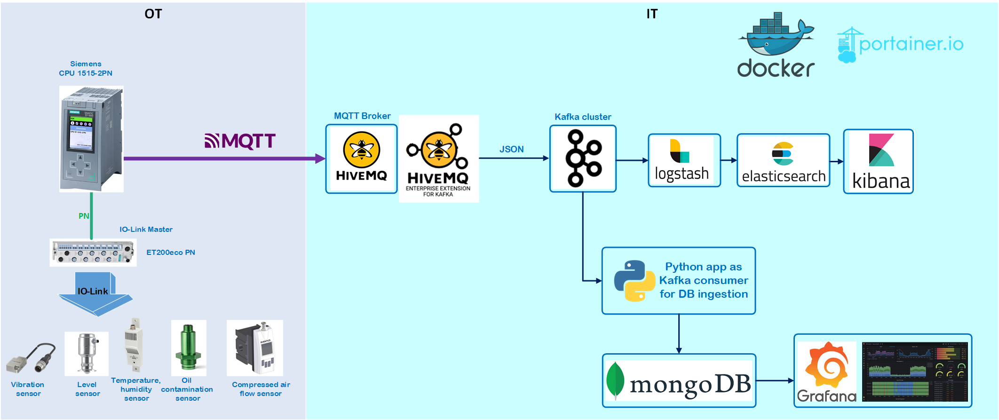

### General Overview
The purpose of this project is to collect data from different sensors, states and devices connected to PLC in OT area.
The collected data are proprocessed in Siemens PLC, converted into JSON structure and published as MQTT message to HiveMQ MQTT Broker.

HiveMQ broker is equipped with Extension for Kafka. This implementation enables seamless integration of MQTT messages from OT into Kafka data streaming.

Kafka broker processes the incoming data stream as topics.

Next, two parallel data stream pipelines are available:
- Python script which acts as Kafka consumer and stores the data into MongoDB. The results are then visible in Grafana
- ELK stack, where Logstash aggregates data from Kafka topic, processes it and ships to Elasticsearch. Kibana allows exploring and validation of data ingested from Kafka and indexed in Elasticsearch. Morover, Kibana provides the ability to create visualizations and dashboards that can help make the analysis more intuitive and interactive.

All elements of above mentioned pipeline are implemented as containers with usage of Docker-Compose.

### Detailed description:

* [Sensor / states evaluation in PLC](#sensorstates-evaluation-in-plc)

* [HiveMQ Broker](#hivemq-broker)

* [Kafka Broker](#kafka-broker-bitnami)

* [Python app as Kafka consumer](#python-app---kafka-consumer)

* [MongoDB](#mongodb)

* [Grafana](#grafana)

* [Logstash](#logstash)

* [Elasticsearch](#elasticsearch)

* [Kibana](#kibana)

#### Sensor/states evaluation in PLC 
The begin of the IIoT pipeline is the PLC code which evaluates sensors and states from machine/line and converts their values into JSON structure with timestamp which are then published as MQTT payloads.

Example of single sensor evaluation in TIA Portal is depicted on this picture.

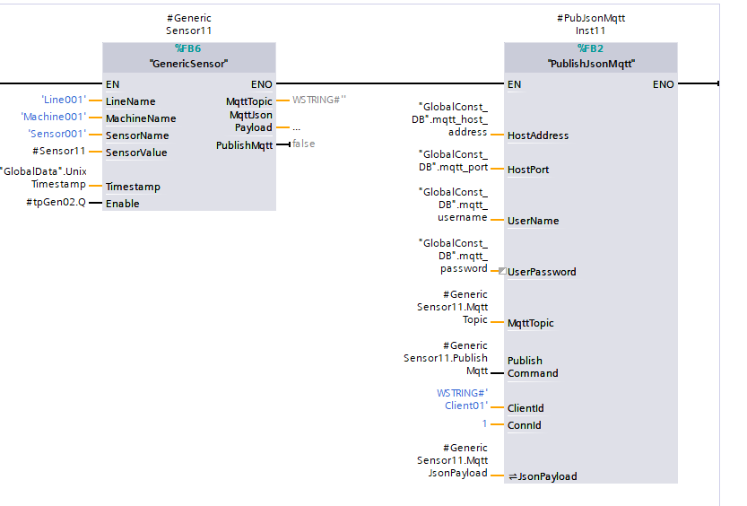


<br>
Data from PLC as mqtt messages in MQTT explorer:

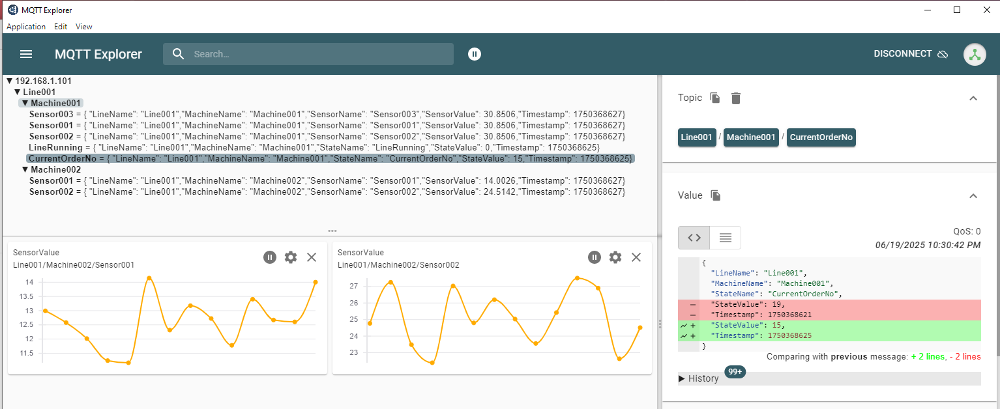

#### HiveMQ Broker

Incoming mqtt traffic can be seen directly in HiveMQ broker:

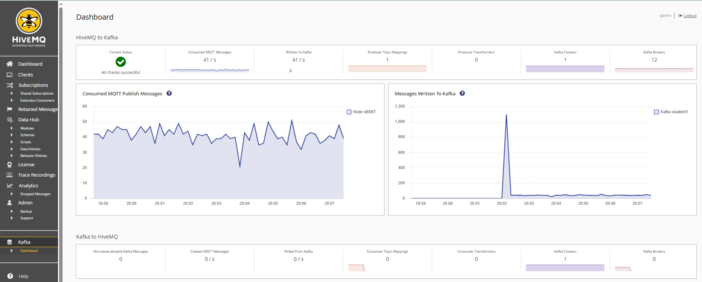

<br>

The mqtt topics in HiveMQ broker must be forwared to Kafka topics.
This configuration is done in file `config.xml` located at 
`apps_data/hivemq/extensions/hivemq-kafka-extension/conf/config.xml`


In this project, as example, two mqtt topics (`Line001/Machine001/#` and `Line001/Machine002/#`) are forwarded to Kafka topics (`MachineMonitor1` and `MachineMonitor2`). However the topic configuration and forwarding is freely to modify and choose according to project needs.

The IP address `192.168.1.101:9092` in the `config.xml` is the host IP (where docker stack is running)

```
<?xml version="1.0" encoding="UTF-8" ?>
<kafka-configuration xmlns:xsi="http://www.w3.org/2001/XMLSchema-instance"
                     xsi:noNamespaceSchemaLocation="config.xsd">
    <kafka-clusters>
        <kafka-cluster>
            <id>cluster01</id>
            <bootstrap-servers>192.168.1.101:9092</bootstrap-servers>
            <tls>
            	<enabled>no</enabled>
            </tls>
        </kafka-cluster>
    </kafka-clusters>

    <mqtt-to-kafka-mappings>
        <mqtt-to-kafka-mapping>
            <id>mapping01</id>
            <cluster-id>cluster01</cluster-id>
            <mqtt-topic-filters>
                <mqtt-topic-filter>Line001/Machine001/#</mqtt-topic-filter>
            </mqtt-topic-filters>
            <kafka-topic>MachineMonitor1</kafka-topic>
        </mqtt-to-kafka-mapping>
        
        <mqtt-to-kafka-mapping>
            <id>mapping02</id>
            <cluster-id>cluster01</cluster-id>
            <mqtt-topic-filters>
                <mqtt-topic-filter>Line001/Machine002/#</mqtt-topic-filter>
            </mqtt-topic-filters>
            <kafka-topic>MachineMonitor2</kafka-topic>
        </mqtt-to-kafka-mapping>
        
    </mqtt-to-kafka-mappings>

</kafka-configuration>
```

To enable the HiveMQ Extension for Kafka, locate the `hivemq-kafka-extension` folder in the extensions directory 
`apps_data/hivemq/extensions/` and remove the `DISABLED` file.


#### Kafka broker (Bitnami)

Kafka broker from Bitnami comes together with `zookeeper` (kind of broker manager) and useful `kafka-ui` for easy configuration.

Starting the `kafka-ui` on port 8081, first it needs to configure Kafka topics:

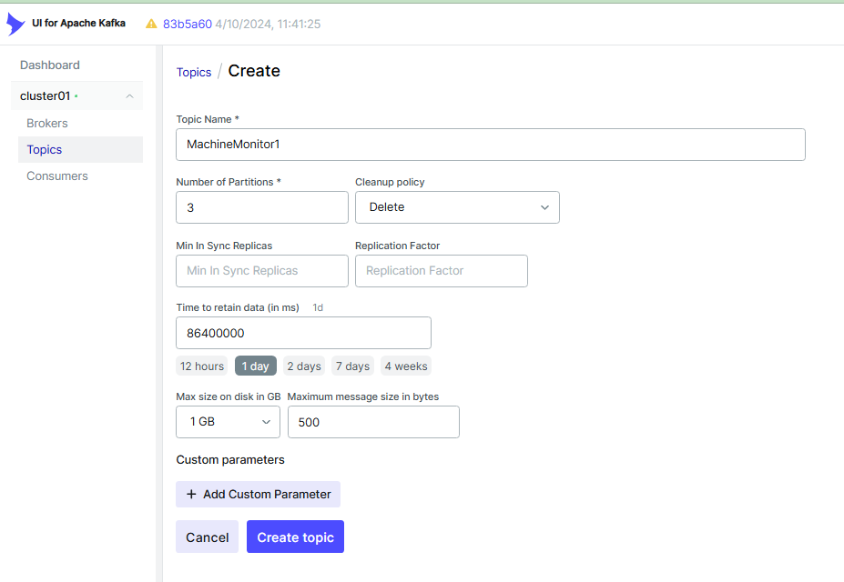

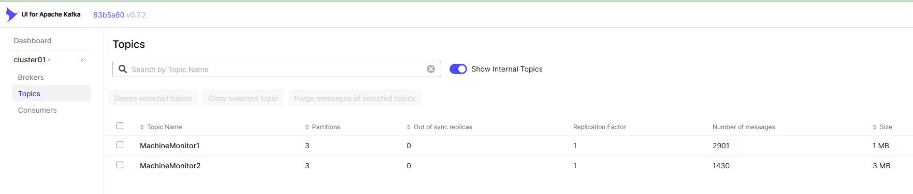


<br>
In this project, each Kafka topic is subdivided into three partitions:

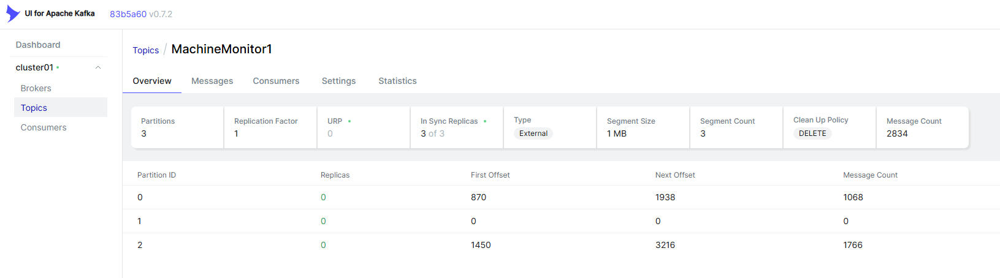
This allows that messages in one partion can be processed in parallel with other paritions, increasing the througput.

<br>

Incoming Kafka messages can be observed in `kafka-ui`:
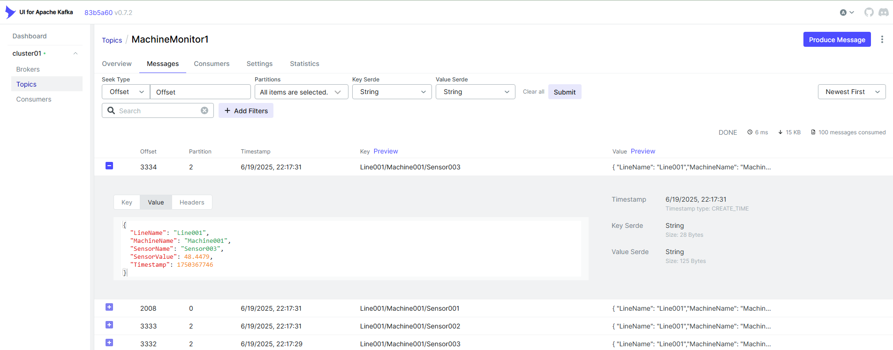

#### Python app - Kafka consumer

Python app `kafka_message_handler` located in `./src` is simple Kafka consumer which subscribes to given Kafka topic (env variable `KAFKA_TOPIC`) and continuously stores data from the Kafka topic to the specified collection in the MongoDB database in real-time (stream job). 

stores the Kafka messages in MongoDB. This app starts as docker container.

#### MongoDB
Python app `kafka_message_handler` expects defined database and collections in MongodDB. Therefore, after the MongoDB container is started for the first time, create database named `iiot_timeseries` and collections `sensors` and `states` where respective data will be saved.

Collections should be defined as time series. This could be defined in UI during database creation or just as command in mongosh:

```
db.createCollection(
   "sensors",
   {
      timeseries: {
         timeField: "date",
         metaField: "LineName",
         granularity: "seconds"
      }
    })
```

<br>
View of created MongoDB database and time-series collections:

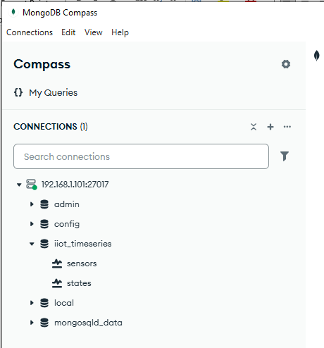


#### Grafana
Data stored in MongoDB can be visualized in Grafana.
This project uses free plugin `mongodb-datasource
` from `haohanyang`.


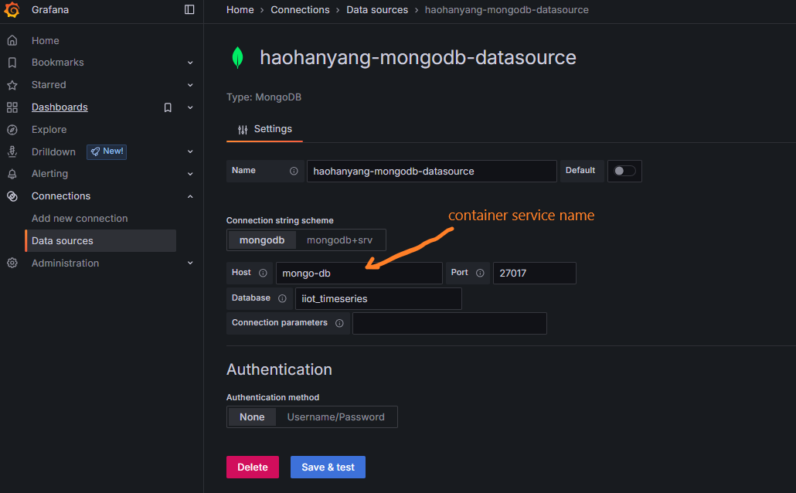

<br>

Examples of time series visualization:
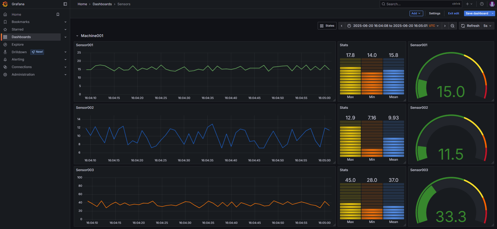

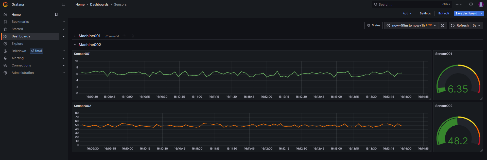

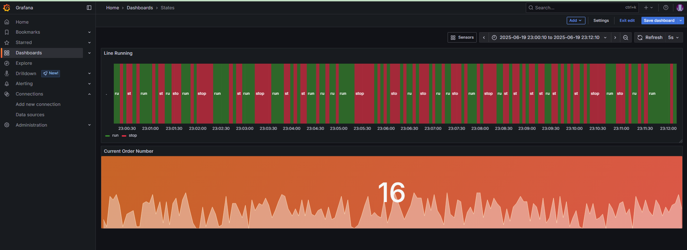

<br>

Query for sensor values on `sensors` collection:
```
[
    {
        "$match": {
            "date": {
                "$gte": {
                    "$date": {
                        "$numberLong": "$__from"
                            }
                        },
                "$lt": {
                    "$date": {
                        "$numberLong": "$__to"
                            }
                        }
                    },
        "sensorName": "Sensor001",
        "machineName": "Machine001",
        "lineName": "Line001"  
                  }
        
    }
]
```

Query for `max`(`min` and `avg` also possible) value of sensor:
```
[
    {
        "$match": {
            "date": {
                "$gte": {
                    "$date": {
                        "$numberLong": "$__from"
                            }
                        },
                "$lt": {
                    "$date": {
                        "$numberLong": "$__to"
                            }
                        }
                    },
        "sensorName": "Sensor001",
        "machineName": "Machine001",
        "lineName": "Line001"  
                  }
        
    },
    {
        "$group":
                    {
                       "_id": "max",
                       "maxQA": {"$max": "$sensorValue"} 
                    }
                    
    
    }
]
```

#### Logstash
Logstash is configured as Kafka consumer and creates pipeline to ingest stream data messages from Kafka to Elasticsearch.

Config is located in `./apps_data/logstash/logstash.conf`

#### Elasticsearch

Opening Elasticsearch on `host_ip:9200/_cat/indices?v` should depict all running indices and confirm that Logstash aggregates data from Kafka and ships it into Elasticsearch:
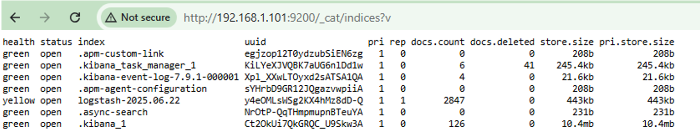


#### Kibana
Kibana allows analyzing the data indexed by Elasticsearch.
Starting the Kibana on `host_ip:5061` it shows the logstash index and now it's possible to filter and visualize the data from sensors/states:
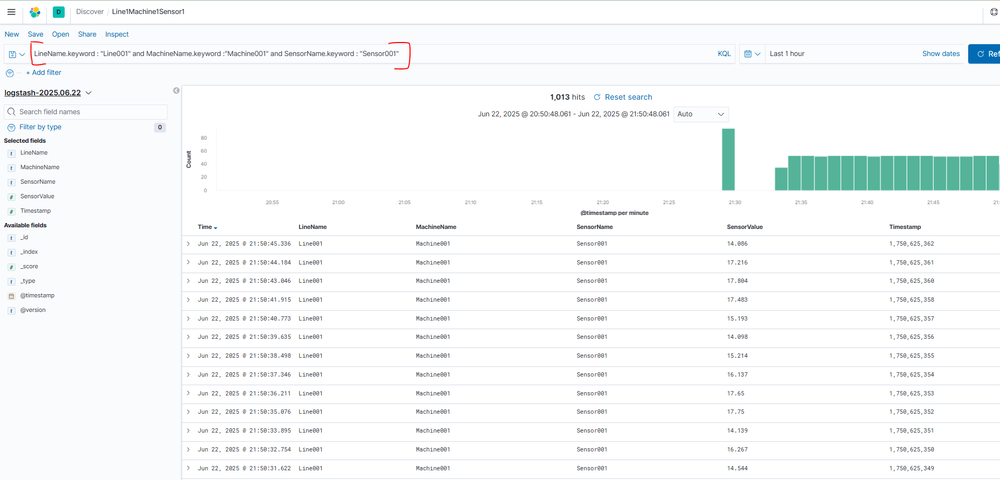
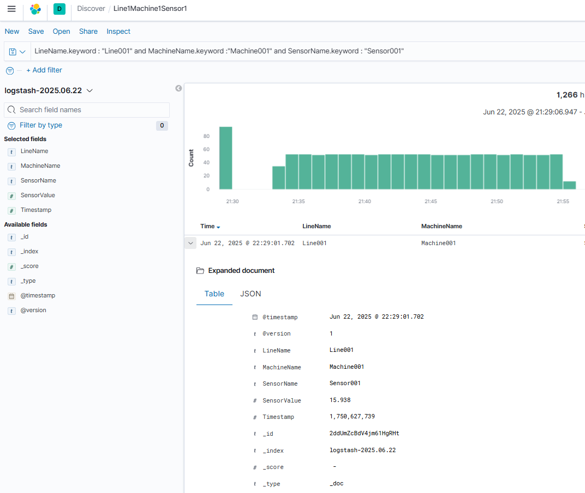
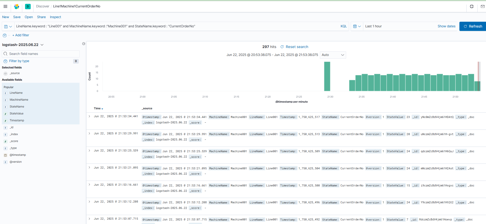
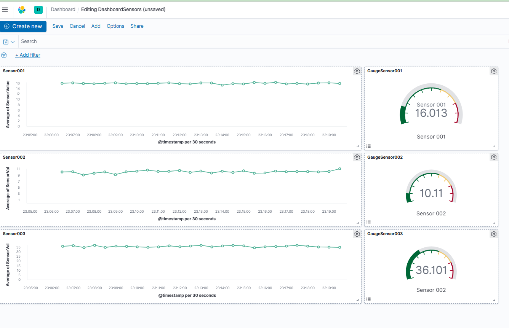


### Setup & Run
The prerequisite is that Docker/Docker-Compose is installed on the target system.

First build docker image for Python app:
```
cd /src/kafka_message_handler/build
bash build_image.sh
```

Next, navigate to the main directory of the the project and start the whole IIoT pipeline with the docker-compose:
```
bash compose_start.sh
```

